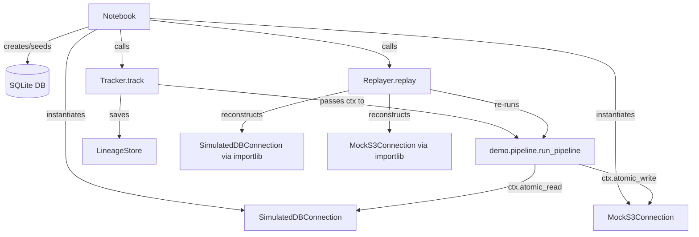

# Design Document — Demo Notebook

## Table of Contents

- [Overview](#overview)
- [Architecture](#architecture)
  - [File Layout](#file-layout)
  - [Component Relationships](#component-relationships)
- [Components and Interfaces](#components-and-interfaces)
  - [SimulatedDBConnection](#simulateddbconnection)
  - [MockS3Connection](#mocks3connection)
  - [Pipeline Function](#pipeline-function)
  - [Notebook Cells](#notebook-cells)
- [Data Models](#data-models)
  - [SQLite Schema](#sqlite-schema)
  - [MockS3Connection Reconstruction](#mocks3connection-reconstruction)
- [Correctness Properties](#correctness-properties)
- [Error Handling](#error-handling)
- [Testing Strategy](#testing-strategy)
  - [Unit Tests](#unit-tests)
  - [Property-Based Tests](#property-based-tests)

---

## Overview

The demo notebook is a self-contained, top-to-bottom runnable Jupyter notebook that
demonstrates the `file_pipeline_lineage` package end-to-end. It lives entirely under
`demo/` at the project root and requires no external services — a SQLite database
simulates the DB source and a mocked boto3 client simulates S3.

The notebook walks through: seeding a SQLite DB, defining custom connections, running
the pipeline via `Tracker`, inspecting the `LineageRecord`, replaying via `Replayer`,
verifying byte-for-byte output equality, and cleaning up.

---

## Architecture

### File Layout

```
demo/
  __init__.py            # makes demo/ a package so demo.pipeline is importable
  pipeline.py            # module-level pipeline function (importable by Replayer)
  demo_notebook.ipynb    # the Jupyter notebook
```

No files are placed at the project root. The `demo/` directory is a Python package so
that `function_ref = "demo.pipeline:run_pipeline"` resolves correctly when the Replayer
imports it from a git worktree.

### Component Relationships



---

## Components and Interfaces

### SimulatedDBConnection

Defined in `demo/pipeline.py` (or a helper imported by it). Subclasses `Connection`.

```python
class SimulatedDBConnection(Connection):
    def __init__(self, db_path: str) -> None: ...
    def atomic_read(self, timestamp_utc=None) -> pd.DataFrame: ...
    def serialise(self) -> dict: ...          # {"db_path": str}
    supports_time_travel = False
```

- `atomic_read(None)` opens the SQLite file, runs `SELECT * FROM records`, returns a DataFrame directly (all data at once — no streaming).
- `atomic_read(non-None)` raises `UnsupportedOperationError`.
- `serialise()` returns `{"db_path": str(self.db_path)}` — no runtime state.
- Reconstructable: `SimulatedDBConnection(**conn.serialise())` works identically.

### MockS3Connection

Also defined in `demo/pipeline.py`. Wraps `S3Connection` with a patched boto3 client.

```python
class MockS3Connection(Connection):
    def __init__(self, bucket: str, key: str, time_travel: bool = False) -> None: ...
    def atomic_write(self, data, run_id, overwrite=False) -> WriteResult: ...
    def serialise(self) -> dict: ...   # {"bucket": ..., "key": ..., "time_travel": False}
    supports_time_travel = False
```

See [MockS3Connection Reconstruction](#mocks3connection-reconstruction) for how the mock
boto3 client is handled during replay.

### Pipeline Function

```python
# demo/pipeline.py
def run_pipeline(ctx: RunContext) -> None:
    df = ctx.atomic_read(SimulatedDBConnection(DB_PATH))
    transformed = df[df["value"] > 0].copy()
    transformed["label"] = transformed["value"].astype(str)
    csv_bytes = transformed.to_csv(index=False).encode()
    ctx.atomic_write(MockS3Connection("demo-bucket", "output/results.csv"), csv_bytes)
```

`DB_PATH` is a module-level variable set by the notebook before calling `Tracker.track()`.
The function is at module level so `function_ref = "demo.pipeline:run_pipeline"` is valid.

### Notebook Cells

| Section | Cell type | Purpose |
|---|---|---|
| Title + TOC | Markdown | Navigation |
| Setup | Code | Create SQLite DB, seed data, set `DB_PATH`, create `LineageStore` |
| Custom Connections | Code | Define `SimulatedDBConnection`, `MockS3Connection` |
| Pipeline Function | Code | Import `run_pipeline` from `demo.pipeline` |
| Git commit | Code | Ensure `demo/pipeline.py` is committed |
| Run the Pipeline | Code | `tracker.track(run_pipeline, output_dir)` |
| Inspect Lineage | Code | Pretty-print `LineageRecord` as JSON |
| Replay | Code | `replayer.replay(record.run_id)` |
| Verify Replay | Code | Byte-for-byte comparison + success message |
| Cleanup | Code | Delete SQLite DB and temp dirs |

---

## Data Models

### SQLite Schema

```sql
CREATE TABLE records (id INTEGER PRIMARY KEY, value REAL, label TEXT);
INSERT INTO records VALUES (1, 10.5, 'a'), (2, -3.0, 'b'), (3, 7.2, 'c');
```

The setup cell creates this file at a temp path and stores the path in `DB_PATH`.

### MockS3Connection Reconstruction

The `Replayer` reconstructs connections via `cls(**connection_args)` where
`connection_args = conn.serialise()`. For `MockS3Connection`, `serialise()` returns
`{"bucket": ..., "key": ..., "time_travel": False}` — identical to `S3Connection`.

The mock boto3 client must **not** be stored in `connection_args` (it is not
JSON-serialisable). Instead, `MockS3Connection.__init__` always creates a fresh
`MagicMock` for the boto3 client internally. This means:

- Original run: `MockS3Connection("demo-bucket", "output/results.csv")` → fresh mock.
- Replay: `MockS3Connection(**{"bucket": "demo-bucket", "key": "output/results.csv",
  "time_travel": False})` → fresh mock again.

Each instance gets its own isolated in-memory store. The replay output is written to the
replay mock's store, not the original's — which is correct because replay outputs are
isolated by design. The `Replayer` reconstructs the connection purely to re-execute the
write; the output bytes are what matter for verification, not the mock's internal state.

---

## Correctness Properties

*A property is a characteristic or behavior that should hold true across all valid
executions of a system — essentially, a formal statement about what the system should do.
Properties serve as the bridge between human-readable specifications and machine-verifiable
correctness guarantees.*

### Property 1: SimulatedDBConnection serialise round-trip

*For any* `db_path` string, `SimulatedDBConnection(**conn.serialise()).serialise()` must
equal `conn.serialise()`.

**Validates: Requirements 2.3, 2.4**

### Property 2: MockS3Connection serialise round-trip

*For any* `bucket`, `key`, and `time_travel` values, `MockS3Connection(**conn.serialise()).serialise()`
must equal `conn.serialise()`.

**Validates: Requirements 3.3, 3.4**

### Property 3: Pipeline output is deterministic

*For any* input DataFrame, calling `run_pipeline` twice with the same data must produce
byte-for-byte identical CSV output.

**Validates: Requirements 5.3**

### Property 4: MockS3Connection overwrite status is correct

*For any* `MockS3Connection`, writing to a new key returns `NO_OVERWRITE`; writing to the
same key a second time returns `OVERWRITE`.

**Validates: Requirements 3.6**

### Property 5: Tracker produces a complete LineageRecord

*For any* valid `db_path` and pipeline execution, the returned `LineageRecord` must have
`status == "success"`, exactly one input descriptor identifying `SimulatedDBConnection`,
exactly one output descriptor identifying `MockS3Connection`, a 40-char hex `git_commit`,
and a `function_ref` in `"module:qualname"` format.

**Validates: Requirements 6.1, 6.2, 6.3, 6.4, 6.5**

### Property 6: Replay produces matching outputs

*For any* original run, `Replayer.replay(run_id)` must produce a `LineageRecord` with
`status == "success"`, `original_run_id` equal to the original `run_id`, a distinct
`run_id`, and output bytes identical to the original run's output bytes.

**Validates: Requirements 8.1, 8.2, 8.3, 9.1**

---

## Error Handling

| Scenario | Handling |
|---|---|
| `read()` called with non-None timestamp | `SimulatedDBConnection` raises `UnsupportedOperationError` |
| SQLite DB file missing at read time | `sqlite3.OperationalError` propagates; notebook setup cell must run first |
| `demo/pipeline.py` not committed before `track()` | `Tracker` raises `LineageError` (no git commit); notebook includes a git-commit cell |
| `MockS3Connection` reconstruction during replay | Fresh mock created in `__init__`; no credentials or state needed |
| Cleanup cell fails | Uses `shutil.rmtree(..., ignore_errors=True)` and `Path.unlink(missing_ok=True)` |

---

## Testing Strategy

### Unit Tests

Located in `tests/test_demo_connections.py`. Focus on specific examples and edge cases:

- `SimulatedDBConnection.read()` returns a DataFrame with expected columns and rows.
- `SimulatedDBConnection.read(timestamp)` raises `UnsupportedOperationError`.
- `MockS3Connection.atomic_write()` returns `NO_OVERWRITE` on first write, `OVERWRITE` on second.
- `MockS3Connection.serialise()` matches `S3Connection.serialise()` shape.
- `ConnectionContractTests` subclass for both connections (runs all contract checks).

### Property-Based Tests

Located in `tests/test_demo_properties.py`. Uses `hypothesis` (already in dev deps).
Each test runs a minimum of 100 iterations.

```
# Feature: demo-notebook, Property 1: SimulatedDBConnection serialise round-trip
# Feature: demo-notebook, Property 2: MockS3Connection serialise round-trip
# Feature: demo-notebook, Property 3: Pipeline output is deterministic
# Feature: demo-notebook, Property 4: MockS3Connection overwrite status is correct
# Feature: demo-notebook, Property 5: Tracker produces a complete LineageRecord
# Feature: demo-notebook, Property 6: Replay produces matching outputs
```

Properties 5 and 6 require a real git repo with `demo/pipeline.py` committed; they are
tagged `@pytest.mark.integration` and skipped in environments without git.
