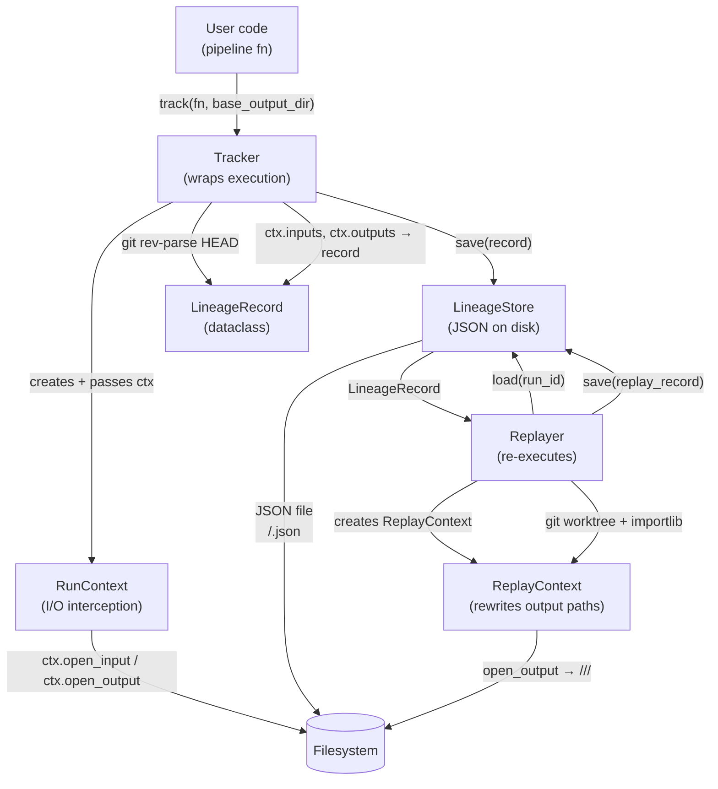

# Design Document: file-pipeline-lineage

## Overview

`file_pipeline_lineage` is a Python package that wraps file-based data pipeline functions to capture full lineage: the git commit and importable reference of the code that ran, the files consumed, the files produced, and enough metadata to replay any past run exactly. The design prioritises simplicity, stdlib-only dependencies, and strict output isolation so that no run can ever overwrite another's results.

The package exposes three public components:

- `Tracker` — wraps a pipeline function call, assigns a Run_ID, creates a `RunContext`, captures the current git commit SHA and the function's fully-qualified reference, records inputs/outputs intercepted via the `RunContext`, and persists a `LineageRecord` on completion or failure.
- `LineageStore` — reads and writes `LineageRecord` JSON files on disk, keyed by Run_ID, using atomic temp-file-then-rename writes.
- `Replayer` — loads a `LineageRecord`, validates that original inputs still exist, checks out the recorded git commit into a temporary worktree, imports the function by its recorded reference, re-executes it via a `ReplayContext` that rewrites output paths to an isolated directory, cleans up the worktree, and records a new `LineageRecord` for the replay.

A `RunContext` is the I/O interception mechanism: the pipeline function calls `ctx.open_input(path)` and `ctx.open_output(path)` instead of plain `open()`. The `RunContext` records every path accessed and delegates to the real filesystem. For output files, it constructs the actual write path as `<base_output_dir>/<run_id>/<filename>`, guaranteeing per-run isolation by construction. The `ReplayContext` (used during replay) additionally rewrites output paths to `<replay_root>/<orig_run_id>/<replay_run_id>/<filename>`.

A `LineageRecord` dataclass is the shared data model that flows between all three components.

---

## Architecture



### Key Design Decisions

1. **I/O wrapper interception via `RunContext`** — the pipeline function receives a `RunContext` and calls `ctx.open_input(path)` / `ctx.open_output(path)` instead of plain `open()`. The `RunContext` intercepts these calls, records the actual paths accessed, and delegates to the real filesystem. Lineage is captured from actual I/O, not upfront declarations — eliminating false positives and missed writes. This maps conceptually to OpenLineage's dataset facets (inputs/outputs on a Run), making it straightforward to emit OpenLineage events from the context wrappers in future without changing the pipeline function API.
2. **`RunContext` constructs unique output paths** — when `ctx.open_output("results.csv")` is called, the actual write goes to `<base_output_dir>/<run_id>/results.csv`. This guarantees concurrent run isolation by construction; no two runs can share an output path. The caller retrieves the actual resolved paths from `LineageRecord.output_paths`.
3. **`ReplayContext` rewrites output paths** — the `Replayer` provides a `ReplayContext` (subclass of `RunContext`) that intercepts `open_output()` calls and rewrites the path to `<replay_root>/<orig_run_id>/<replay_run_id>/<original_filename>`. Input paths are passed through unchanged after validation.
4. **LineageStore is path-agnostic** — it accepts a `store_root` directory at construction time, making it easy to point at different stores in tests vs. production.
5. **Tracker captures git commit via `subprocess.run`** — at the start of each run, the Tracker calls `git rev-parse HEAD` via `subprocess.run` to obtain the full commit SHA. If the working directory is not a git repository or has no commits, a `LineageError` is raised before execution begins.
6. **Replayer uses `git worktree add` + `importlib`** — to replay, the Replayer runs `git worktree add <tmpdir> <commit>` to check out the recorded commit into a temporary directory, prepends that directory to `sys.path`, then uses `importlib.import_module` and `getattr` to load the function identified by `function_ref`. The worktree is removed via `git worktree remove` after replay completes (or fails), ensuring no leftover state.
7. **Atomic writes via `tempfile` + `os.replace`** — `os.replace` is atomic on POSIX and best-effort on Windows (stdlib, no third-party deps).

---

## Components and Interfaces

### `RunContext`

The I/O interception object passed to every pipeline function. The pipeline uses it for all file access instead of calling `open()` directly.

```python
class RunContext:
    def open_input(self, path: str | Path, mode: str = "r", **kwargs) -> IO:
        """Open a file for reading and record it as an input."""

    def open_output(self, path: str | Path, mode: str = "w", **kwargs) -> IO:
        """
        Open a file for writing. The actual file is created at
        <base_output_dir>/<run_id>/<original_filename>. Records the
        resolved path in ctx.outputs.
        """

    @property
    def run_id(self) -> str:
        """The Run_ID for this execution."""

    @property
    def inputs(self) -> tuple[str, ...]:
        """All input paths opened so far (as provided by the caller)."""

    @property
    def outputs(self) -> tuple[str, ...]:
        """All resolved output paths opened so far (<base_output_dir>/<run_id>/<filename>)."""
```

`ReplayContext` is a subclass of `RunContext` used by the `Replayer`. It overrides `open_output()` to write to `<replay_root>/<orig_run_id>/<replay_run_id>/<original_filename>` instead of the `base_output_dir` path. Input paths are passed through unchanged.

### `LineageRecord` (dataclass)

The central data model. Immutable after creation (frozen dataclass).

```python
@dataclass(frozen=True)
class LineageRecord:
    run_id: str                    # UUID4 string
    timestamp_utc: str             # ISO-8601 UTC, e.g. "2024-01-15T10:30:00.123456+00:00"
    function_name: str             # Name of the pipeline function
    git_commit: str                # Full SHA of HEAD at the time track() was called
    function_ref: str              # Fully-qualified reference, e.g. "mypackage.pipelines:transform"
    input_paths: tuple[str, ...]   # Paths as provided to ctx.open_input()
    output_paths: tuple[str, ...]  # Resolved paths as constructed by RunContext/ReplayContext
    status: str                    # "success" | "failed"
    exception_message: str | None  # None on success; str on failure
    original_run_id: str | None    # None for original runs; set for replay runs
```

### `LineageStore`

```python
class LineageStore:
    def __init__(self, store_root: str | Path) -> None: ...

    def save(self, record: LineageRecord) -> Path:
        """Atomically write record as JSON. Returns the path written."""

    def load(self, run_id: str) -> LineageRecord:
        """Load and deserialise record. Raises RunNotFoundError if absent."""

    def list_run_ids(self) -> list[str]:
        """Return all stored Run_IDs (unsorted)."""
```

### `Tracker`

```python
class Tracker:
    def __init__(self, store: LineageStore) -> None: ...

    def track(
        self,
        fn: Callable[[RunContext], None],
        base_output_dir: str | Path,
    ) -> LineageRecord:
        """
        Create a RunContext, execute fn(ctx), capture lineage from ctx.inputs
        and ctx.outputs, persist record.
        On exception: records failed status + ctx.outputs at exception time, re-raises.
        Returns the LineageRecord on success.
        """
```

The pipeline function signature is `(ctx: RunContext) -> None`. The `Tracker` constructs the `RunContext` with the assigned `run_id` and `base_output_dir`, then calls `fn(ctx)`.

### `Replayer`

```python
class Replayer:
    def __init__(
        self,
        store: LineageStore,
        replay_root: str | Path,
    ) -> None: ...

    def replay(self, run_id: str) -> LineageRecord:
        """
        Load record for run_id, validate inputs exist, run `git worktree add <tmpdir> <commit>`
        to check out the recorded commit, import the function via importlib using function_ref,
        execute it via a ReplayContext that rewrites open_output() calls to
        <replay_root>/<run_id>/<replay_run_id>/<filename>,
        clean up the worktree, and record new lineage.
        Raises MissingInputError if any input file is absent.
        Raises MissingCommitError if the recorded git commit does not exist in the repository.
        Returns the new replay LineageRecord.
        """
```

### Exceptions

```python
class LineageError(Exception): ...          # base
class RunNotFoundError(LineageError): ...   # unknown run_id
class MissingInputError(LineageError): ...  # input file(s) gone
class MissingCommitError(LineageError): ... # recorded git commit not found in repo
```

### Public API (`__init__.py` exports)

```python
from file_pipeline_lineage import (
    LineageRecord,
    LineageStore,
    RunContext,
    Tracker,
    Replayer,
    LineageError,
    RunNotFoundError,
    MissingInputError,
    MissingCommitError,
)
```

---

## Data Models

### `LineageRecord` JSON Schema

Each record is stored as a single JSON object. Field names match the dataclass attributes exactly.

```json
{
  "$schema": "http://json-schema.org/draft-07/schema#",
  "title": "LineageRecord",
  "type": "object",
  "required": [
    "run_id", "timestamp_utc", "function_name", "git_commit", "function_ref",
    "input_paths", "output_paths", "status"
  ],
  "properties": {
    "run_id":             { "type": "string", "format": "uuid" },
    "timestamp_utc":      { "type": "string", "format": "date-time" },
    "function_name":      { "type": "string" },
    "git_commit":         { "type": "string", "description": "Full SHA of HEAD at track() time" },
    "function_ref":       { "type": "string", "description": "e.g. mypackage.pipelines:transform" },
    "input_paths":        { "type": "array", "items": { "type": "string" }, "description": "Paths as provided to ctx.open_input()" },
    "output_paths":       { "type": "array", "items": { "type": "string" }, "description": "Resolved paths constructed by RunContext/ReplayContext" },
    "status":             { "type": "string", "enum": ["success", "failed"] },
    "exception_message":  { "type": ["string", "null"] },
    "original_run_id":    { "type": ["string", "null"], "format": "uuid" }
  },
  "additionalProperties": false
}
```

### Disk Layout

```
<store_root>/
  <run_id_1>.json
  <run_id_2>.json
  ...

<base_output_dir>/
  <run_id_1>/
    output_file_1.csv
    output_file_2.csv
  <run_id_2>/
    output_file_1.csv

<replay_root>/
  <original_run_id>/
    <replay_run_id_A>/
      output_file_1.csv
      output_file_2.csv
    <replay_run_id_B>/
      output_file_1.csv
```

- `store_root`, `base_output_dir`, and `replay_root` are independent directories (can be the same parent or different).
- Each lineage JSON file is named `<run_id>.json` — no subdirectories needed; UUID4 filenames are collision-free.
- Original run outputs live under `<base_output_dir>/<run_id>/` — the `RunContext` constructs this path automatically when `ctx.open_output(filename)` is called.
- Replay output directories are `<replay_root>/<original_run_id>/<replay_run_id>/` — two levels of UUID ensure both the source run and the specific replay are identifiable from the path alone.

### Atomic Write Strategy

```
1. Serialise LineageRecord to JSON bytes.
2. Write to a temp file in the same directory as the target:
       tempfile.NamedTemporaryFile(dir=store_root, delete=False, suffix=".tmp")
3. Flush + fsync the temp file.
4. os.replace(tmp_path, target_path)   # atomic on POSIX; best-effort on Windows
```

`os.replace` is used (not `os.rename`) because it overwrites atomically on POSIX. The temp file lives in the same directory as the target to guarantee they are on the same filesystem (required for rename atomicity).

### How the Tracker Captures I/O via RunContext

The `Tracker` does **not** inspect the filesystem after execution. Instead:

1. The `Tracker` constructs a `RunContext` with the assigned `run_id` and `base_output_dir`, then calls `fn(ctx)`.
2. The pipeline calls `ctx.open_input(path)` for every file it reads — the `RunContext` records the path in `ctx.inputs` and delegates to the real `open()`.
3. The pipeline calls `ctx.open_output(filename)` for every file it writes — the `RunContext` resolves the actual path to `<base_output_dir>/<run_id>/<filename>`, records the resolved path in `ctx.outputs`, creates any necessary parent directories, and delegates to the real `open()`.
4. After `fn` returns (or raises), the `Tracker` reads `ctx.inputs` and `ctx.outputs` to populate the `LineageRecord`.
5. On failure, `ctx.outputs` at the time of the exception captures exactly the files that were opened for writing — these are recorded as partial outputs in the failed `LineageRecord`.

---

## Correctness Properties

*A property is a characteristic or behavior that should hold true across all valid executions of a system — essentially, a formal statement about what the system should do. Properties serve as the bridge between human-readable specifications and machine-verifiable correctness guarantees.*

### Property 1: LineageRecord completeness

*For any* pipeline function and any `base_output_dir`, when the Tracker executes a successful run, the returned `LineageRecord` must contain a valid UUID4 `run_id`, a UTC `timestamp_utc`, the git commit SHA, the fully-qualified function reference, all paths passed to `ctx.open_input()`, all resolved paths from `ctx.open_output()`, and `status == "success"`.

**Validates: Requirements 1.1, 1.3, 1.4, 1.6**

---

### Property 2: Run_ID uniqueness

*For any* collection of pipeline runs (regardless of concurrency), all assigned `run_id` values must be distinct UUID4 strings.

**Validates: Requirements 1.2, 7.1**

---

### Property 3: Failed run captures partial outputs and re-raises

*For any* pipeline function that raises an exception after calling `ctx.open_output()` for some (but not all) of its output files, the Tracker must: record `status == "failed"`, set `exception_message` to the exception's string representation, record in `output_paths` exactly the resolved paths that were in `ctx.outputs` at the time of the exception, and re-raise the original exception to the caller.

**Validates: Requirements 1.5**

---

### Property 4: LineageStore save/load round-trip

*For any* valid `LineageRecord`, saving it to the `LineageStore` and then loading it back by `run_id` must produce a record equal to the original.

**Validates: Requirements 2.1, 2.4**

---

### Property 5: Distinct Run_IDs get distinct storage paths

*For any* two `LineageRecord` objects with different `run_id` values, the file paths the `LineageStore` assigns to them must be different.

**Validates: Requirements 2.2, 7.2**

---

### Property 6: Missing Run_ID raises RunNotFoundError

*For any* `run_id` string that has not been saved to the `LineageStore`, calling `load(run_id)` must raise `RunNotFoundError` with a message that includes the missing `run_id`.

**Validates: Requirements 2.5**

---

### Property 7: list_run_ids returns exactly the saved Run_IDs

*For any* set of `LineageRecord` objects saved to the `LineageStore`, `list_run_ids()` must return a list containing exactly those `run_id` values — no more, no fewer.

**Validates: Requirements 2.6**

---

### Property 8: Replay produces equivalent outputs

*For any* `LineageRecord` whose input files still exist and whose recorded git commit is present in the repository, replaying the run must produce output files whose content is equivalent to re-running the original pipeline function (loaded via `git worktree add` + `importlib` using the recorded `function_ref`) against the same inputs.

**Validates: Requirements 3.2, 5.4**

---

### Property 9: Replay output directory contains both run IDs

*For any* replay, every output file path produced by the `Replayer` (via `ReplayContext`) must be located under `<replay_root>/<original_run_id>/<replay_run_id>/`, and must not overlap with any path in the original run's `output_paths`.

**Validates: Requirements 3.3, 4.1, 4.2**

---

### Property 10: RunContext constructs output paths under base_output_dir/run_id

*For any* call to `ctx.open_output(filename)` on a `RunContext` constructed with a given `base_output_dir` and `run_id`, the actual file path opened must equal `<base_output_dir>/<run_id>/<filename>`, and this resolved path must appear in `ctx.outputs` and subsequently in `LineageRecord.output_paths`.

**Validates: Requirements 7.4**

---

### Property 11: Replay record references original run_id

*For any* replay, the `LineageRecord` recorded for the `Replay_Run` must have `original_run_id` equal to the `run_id` of the source record.

**Validates: Requirements 3.4**

---

### Property 12: Missing inputs raise MissingInputError before execution

*For any* `LineageRecord` where one or more `input_paths` do not exist on disk, calling `replay()` must raise `MissingInputError` with a message identifying the missing paths, and must not execute the pipeline function or write any output files.

**Validates: Requirements 3.5**

---

### Property 13: Prior outputs are preserved after replay

*For any* output file produced by a prior run or replay, after performing a new replay that file must still exist on disk with identical content.

**Validates: Requirements 4.3**

---

### Property 14: git_commit and function_ref are captured correctly

*For any* pipeline function passed to the `Tracker`, the `git_commit` field in the resulting `LineageRecord` must equal the output of `git rev-parse HEAD` at the time `track()` was called, and `function_ref` must identify the callable that was passed to `track()` in the form `module:function_name`.

**Validates: Requirements 5.1, 5.2**

---

## Error Handling

| Situation | Component | Exception | Behaviour |
|---|---|---|---|
| `load()` called with unknown `run_id` | `LineageStore` | `RunNotFoundError` | Message includes the missing `run_id` |
| `replay()` called when input files are absent | `Replayer` | `MissingInputError` | Message lists all missing paths; no execution |
| Recorded git commit not found in repo | `Replayer` | `MissingCommitError` | Message includes the missing commit SHA; no execution |
| Working directory is not a git repo at track time | `Tracker` | `LineageError` | Raised before execution begins |
| Pipeline function raises during `track()` | `Tracker` | re-raises original | Records failed `LineageRecord` first, then re-raises |
| JSON deserialisation fails on `load()` | `LineageStore` | `LineageError` | Wraps the underlying `json.JSONDecodeError` |

All package exceptions inherit from `LineageError` so callers can catch the base class if they don't need to distinguish types.

---

## Testing Strategy

### Dual Testing Approach

Both unit tests and property-based tests are required. They are complementary:

- **Unit tests** cover specific examples, integration points, and error conditions.
- **Property tests** verify universal invariants across randomly generated inputs.

### Property-Based Testing

The property-based testing library is **[Hypothesis](https://hypothesis.readthedocs.io/)** (`hypothesis` package), which integrates natively with `pytest`.

Each correctness property from the section above maps to exactly one `@given`-decorated test. Tests must be configured to run a minimum of 100 examples (Hypothesis default is 100; increase with `settings(max_examples=...)` where warranted).

Each property test must carry a comment tag in the format:

```
# Feature: file-pipeline-lineage, Property <N>: <property_text>
```

Example:

```python
# Feature: file-pipeline-lineage, Property 4: LineageStore save/load round-trip
@given(record=st.from_type(LineageRecord))
@settings(max_examples=200)
def test_store_round_trip(tmp_path, record):
    store = LineageStore(tmp_path)
    store.save(record)
    loaded = store.load(record.run_id)
    assert loaded == record
```

### Unit Test Coverage

Unit tests should focus on:

- Specific examples demonstrating correct behaviour (e.g. a known pipeline function produces a known output).
- Integration between `Tracker` → `LineageStore` → `Replayer`.
- Error conditions: `RunNotFoundError`, `MissingInputError`, `LineageError` on bad JSON.
- The demo script: assert it exits with code 0 and its stdout contains expected substrings.

Avoid writing unit tests that duplicate what property tests already cover (e.g. don't write 10 unit tests for different input path counts when Property 1 already covers all counts).

### Test File Layout

```
tests/
  test_lineage_record.py     # dataclass construction, serialisation
  test_lineage_store.py      # save/load round-trip, list, missing key
  test_tracker.py            # success path, failure path, source capture
  test_replayer.py           # replay outputs, directory structure, missing inputs
  test_integration.py        # end-to-end: track → store → replay
  test_demo.py               # demo script smoke test
```

### Hypothesis Strategies

Custom `st.composite` strategies will be needed for:

- `LineageRecord` — generate valid UUID4 strings, ISO timestamps, 40-character hex git commit SHAs, `module:function_name` function refs, path lists.
- Partial-failure pipelines — generate `(ctx: RunContext) -> None` functions that call `ctx.open_output()` for N of M outputs then raise.
- `RunContext` fixtures — construct a `RunContext` with a `tmp_path`-based `base_output_dir` and a generated `run_id` for use in property tests that exercise `open_input` / `open_output` directly.

Note: arbitrary importable pipeline functions cannot be generated by Hypothesis. Replay tests in `test_replayer.py` instead use a **temporary git repository fixture** — a `pytest` fixture that initialises a real git repo, commits a known simple pipeline function (using `ctx.open_input` / `ctx.open_output`) at a known SHA, and provides that SHA and `function_ref` to the test. This makes Property 8 and Property 14 tests deterministic and self-contained.
