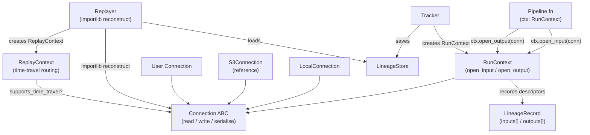

# Design Document: generalised-connections

## Table of Contents

- [Overview](#overview)
- [Architecture](#architecture)
- [Components and Interfaces](#components-and-interfaces)
  - [Connection ABC](#connection-abc)
  - [WriteResult](#writeresult)
  - [LocalConnection](#localconnection)
  - [S3Connection (Reference)](#s3connection-reference)
  - [DB Connector Example (Documentation)](#db-connector-example-documentation)
  - [RunContext Changes](#runcontext-changes)
  - [ReplayContext Changes](#replaycontext-changes)
  - [Replayer Changes](#replayer-changes)
  - [Public API](#public-api)
- [Data Models](#data-models)
  - [LineageRecord (New Shape)](#lineagerecord-new-shape)
  - [Descriptor Schemas](#descriptor-schemas)
  - [JSON Schema](#json-schema)
- [Breaking Changes](#breaking-changes)
- [Correctness Properties](#correctness-properties)
- [Error Handling](#error-handling)
- [Testing Strategy](#testing-strategy)

---

## Overview

This feature generalises `file_pipeline_lineage` beyond local files by introducing a
`Connection` ABC that encapsulates how data is read from and written to any backing store.

`open_input` and `open_output` on `RunContext` now accept only `Connection` objects —
plain path strings are no longer accepted (breaking change). Two built-in connectors ship:
`LocalConnection` (fully supported) and `S3Connection` (reference/example only).

All existing guarantees are preserved: per-run output isolation, conflict-free writes, and
full replay capability. Replay is extended with time travel: connections that declare
`supports_time_travel = True` are called with the recorded `access_timestamp` so replays
reproduce the original data even when the underlying store has since changed.

`LineageRecord` is restructured: `input_paths`/`output_paths` are replaced by `inputs`
and `outputs` — ordered lists of named descriptors carrying connection class, args, and
access metadata. This is a breaking change to the data model and all code that touches it.

---

## Architecture



---

## Components and Interfaces

### Connection ABC

The `Connection` class has **no abstract methods** — it is a mixin/base class that connectors
opt into. All four I/O methods default to raising `UnsupportedOperationError`. No connector
is required to implement all four.

```python
from abc import ABC
from file_pipeline_lineage.exceptions import UnsupportedOperationError

class Connection(ABC):
    def read(self, timestamp_utc: str | None = None):
        """Streaming read. Return type not prescribed — passed directly to user code.
        timestamp_utc=None → live read; ISO-8601 UTC string → time-travel read."""
        raise UnsupportedOperationError(f"{type(self).__name__} does not support read()")

    def atomic_read(self, timestamp_utc: str | None = None):
        """Read and return all data at once. Return type not prescribed."""
        raise UnsupportedOperationError(f"{type(self).__name__} does not support atomic_read()")

    def write(self, run_id: str, overwrite: bool = False):
        """Returns a context manager. WriteResult | None available after __exit__ completes.
        run_id is incorporated into the output address for per-run isolation."""
        raise UnsupportedOperationError(f"{type(self).__name__} does not support write()")

    def atomic_write(self, data, run_id: str, overwrite: bool = False):
        """Write data atomically. Returns WriteResult | None.
        None means the connection cannot determine overwrite status."""
        raise UnsupportedOperationError(f"{type(self).__name__} does not support atomic_write()")

    def serialise(self) -> dict:
        """Concrete method. Returns JSON-serialisable dict of non-secret constructor args.
        Default uses inspect.signature; override to exclude secrets or rename fields."""
        import inspect
        sig = inspect.signature(self.__init__)
        return {name: getattr(self, name) for name in sig.parameters if name != "self"}

    @property
    def supports_time_travel(self) -> bool:
        return False
```

No `ref` property, no URI scheme registry, no `Connection_Factory`.

---

### WriteResult

```python
from enum import Enum
from dataclasses import dataclass

class OverwriteStatus(str, Enum):
    OVERWRITE    = "overwrite"
    NO_OVERWRITE = "no_overwrite"
    UNKNOWN      = "unknown"
    IN_PROGRESS  = "in_progress"

@dataclass(frozen=True)
class WriteResult:
    overwrite_status: OverwriteStatus
```

`OverwriteStatus` values serialise to lowercase strings for JSON compatibility.

`IN_PROGRESS` is set on the output descriptor immediately when `ctx.open_output` is called
(context manager write started). It is updated to a final status when `__exit__` fires
successfully. If `__exit__` never fires (e.g. crash), `IN_PROGRESS` remains in the stored
`LineageRecord` — useful for debugging interrupted runs.

`write()` and `atomic_write()` return `WriteResult | None`. `None` means the connection
cannot determine overwrite status; `RunContext` records `UNKNOWN` in that case.

---

### LocalConnection

Implements `read` and `write` (context manager). Does **not** implement `atomic_read` or
`atomic_write` — calling either raises `UnsupportedOperationError`.

```python
class LocalConnection(Connection):
    """Fully-supported built-in connector for local filesystem paths."""

    def __init__(self, path: str | Path, base_output_dir: str | Path | None = None) -> None: ...

    def read(self, timestamp_utc: str | None = None) -> IO:
        """Opens path for reading. Raises UnsupportedOperationError if timestamp_utc is not None."""

    def write(self, run_id: str, overwrite: bool = False) -> ContextManager:
        """Returns a context manager.
        __enter__: if overwrite=False, check for conflict (raise ConflictError if exists);
                   open file; set output descriptor to IN_PROGRESS.
        __exit__ (success): close file; update descriptor to NO_OVERWRITE or OVERWRITE.
        __exit__ (exception): close/remove partial file; descriptor remains IN_PROGRESS."""

    def serialise(self) -> dict:
        """Returns {"path": "<absolute path>"}."""

    @property
    def supports_time_travel(self) -> bool:
        return False
```

`base_output_dir` is injected by `RunContext` before calling `write`; it is not stored in
`serialise()` output (runtime concern, not connection identity).

---

### S3Connection (Reference)

Implements `read` (streaming via download) and `atomic_write` (single PUT). Does **not**
implement `write` (streaming context manager) or `atomic_read` — calling either raises
`UnsupportedOperationError`.

```python
class S3Connection(Connection):
    """Reference/example S3 connector — not production-ready."""

    def __init__(self, bucket: str, key: str, time_travel: bool = False) -> None: ...

    def read(self, timestamp_utc: str | None = None) -> IO:
        """Streaming download. Live read or time-travel via S3 Object Versioning.
        Raises TimeTravelError if no version exists at/before timestamp_utc.
        Raises ConfigurationError if versioning is not enabled."""

    def atomic_write(self, data, run_id: str, overwrite: bool = False) -> WriteResult:
        """Single PUT to <run_id>/<key_filename> prefix.
        Returns WriteResult with OVERWRITE or NO_OVERWRITE based on whether
        the key existed before upload."""

    def serialise(self) -> dict:
        """Returns {"bucket": "...", "key": "...", "time_travel": bool}.
        AWS credentials are NOT stored as attributes — sourced from environment by boto3."""

    @property
    def supports_time_travel(self) -> bool:
        return self.time_travel
```

AWS credentials are sourced from the environment by `boto3` at call time, never stored.

---

### DB Connector Example (Documentation)

> **Documentation only** — `PostgresConnection` is not shipped as code. This example
> shows how a database connector would implement the three write-capable methods.

```python
class PostgresConnection(Connection):
    """Example: implements atomic_read, atomic_write, and write (transaction context manager)."""

    def __init__(self, dsn: str, table: str) -> None:
        self.dsn = dsn
        self.table = table
        # credentials sourced from dsn or environment — not stored separately

    def atomic_read(self, timestamp_utc: str | None = None) -> list[dict]:
        """SELECT * FROM table — returns all rows as a list of dicts."""
        with psycopg2.connect(self.dsn) as conn:
            with conn.cursor(cursor_factory=RealDictCursor) as cur:
                cur.execute(f"SELECT * FROM {self.table}")
                return cur.fetchall()

    def atomic_write(self, data, run_id: str, overwrite: bool = False) -> WriteResult:
        """Bulk INSERT in a transaction. Returns WriteResult."""
        with psycopg2.connect(self.dsn) as conn:
            with conn.cursor() as cur:
                # insert rows; determine overwrite status from affected row count
                ...
            conn.commit()
        return WriteResult(OverwriteStatus.NO_OVERWRITE)

    def write(self, run_id: str, overwrite: bool = False):
        """Context manager: opens transaction on __enter__, commits on success,
        rolls back on __exit__ exception."""
        return _PostgresTransactionContext(self.dsn, self.table, run_id, overwrite)
```

`serialise()` returns `{"dsn": "...", "table": "..."}`. Credentials embedded in the DSN
are the user's responsibility to manage securely.

---

### RunContext Changes

New signatures (breaking — plain path strings no longer accepted):

```python
def open_input(self, connection: Connection, name: str | None = None): ...
def atomic_read(self, connection: Connection, name: str | None = None): ...
def open_output(self, connection: Connection, name: str | None = None, overwrite: bool = False): ...
def atomic_write(self, connection, data, name: str | None = None, overwrite: bool = False): ...
```

Method behaviour:

| Method | Calls on connection | Returns to caller | Descriptor timing |
|---|---|---|---|
| `open_input` | `conn.read(None)` | result object | recorded at call time |
| `atomic_read` | `conn.atomic_read(None)` | result object | recorded at call time |
| `open_output` | `conn.write(run_id, overwrite)` | context manager | saved as `IN_PROGRESS` immediately; updated on `__exit__` |
| `atomic_write` | `conn.atomic_write(data, run_id, overwrite)` | `WriteResult \| None` | recorded after call; `None` → `UNKNOWN` |

Additional behaviour:
- `access_timestamp` (UTC now) recorded for every `open_input` / `atomic_read` call.
- Auto-name format: `<1-based-index>:<ClassName>(<truncated_params>...)` truncated to 50 chars.
- Duplicate name → raises `DuplicateNameError` immediately, no I/O opened.

`ctx.inputs` and `ctx.outputs` return `tuple[InputDescriptor, ...]` and
`tuple[OutputDescriptor, ...]` respectively (replacing `tuple[str, ...]`).

---

### ReplayContext Changes

`ReplayContext` reconstructs connections from stored descriptors using `importlib`:

```python
module_path, class_name = descriptor.connection_class.split(":", 1)
cls = getattr(importlib.import_module(module_path), class_name)
connection = cls(**descriptor.connection_args)
```

Time-travel routing for `open_input` and `atomic_read`:

```python
if connection.supports_time_travel:
    result = connection.read(descriptor.access_timestamp)   # or atomic_read(...)
    time_travel = True
else:
    result = connection.read(None)   # or atomic_read(None)
    time_travel = False
```

`ReplayContext` overrides `open_input` and `atomic_read` to pass `access_timestamp` when
`supports_time_travel` is `True`. `open_output` and `atomic_write` are passed through
unchanged (replay does not re-write outputs).

`time_travel` is recorded in the replay `LineageRecord`'s input descriptors.

---

### Replayer Changes

- Reconstructs each input `Connection` from `LineageRecord.inputs[i]` descriptors.
- Raises `ConfigurationError` if `importlib` cannot locate the class or `cls(**args)` fails.
- Passes reconstructed connections to `ReplayContext` for time-travel routing.
- Output connections are also reconstructed and passed to `ReplayContext.open_output`.

---

### Public API

New exports added to `__init__.py`:

```python
from file_pipeline_lineage import (
    Connection, LocalConnection, S3Connection,
    WriteResult, OverwriteStatus,
    ConnectionContractTests,
    UnsupportedOperationError, TimeTravelError,
    ConflictError, ConfigurationError, DuplicateNameError,
    # existing exports unchanged
)
```

---

## Data Models

### LineageRecord (New Shape)

`input_paths` and `output_paths` are removed. New fields:

```python
@dataclass(frozen=True)
class LineageRecord:
    run_id: str
    timestamp_utc: str
    function_name: str
    git_commit: str
    function_ref: str
    inputs: tuple[InputDescriptor, ...]   # replaces input_paths
    outputs: tuple[OutputDescriptor, ...]  # replaces output_paths
    status: str
    exception_message: str | None
    original_run_id: str | None
```

---

### Descriptor Schemas

```python
@dataclass(frozen=True)
class InputDescriptor:
    name: str                  # e.g. "1:LocalConnection(path=/data/in.csv)"
    connection_class: str      # e.g. "file_pipeline_lineage.connections:LocalConnection"
    connection_args: dict      # e.g. {"path": "/data/in.csv"}
    access_timestamp: str      # ISO-8601 UTC at moment of open_input/atomic_read call
    time_travel: bool          # False for original runs; True/False for replays

@dataclass(frozen=True)
class OutputDescriptor:
    name: str
    connection_class: str
    connection_args: dict
    overwrite_requested: bool
    overwrite_status: str      # "overwrite" | "no_overwrite" | "unknown" | "in_progress"
```

`connection_class` uses colon-separated fully-qualified path: `"mypackage.connectors:S3Connection"`.

`overwrite_status` is set to `"in_progress"` immediately when `open_output` is called and
updated to a final value when the context manager's `__exit__` fires. If the process
crashes before `__exit__`, `"in_progress"` remains in the stored record.

---

### JSON Schema

`inputs` and `outputs` serialise as JSON arrays of objects. `to_dict()` / `from_dict()`
handle the nested descriptor serialisation. `connection_args` values must be JSON-primitive
(str, int, float, bool, None) — enforced by `serialise()` contract. The `name` field is
the identity key; array order in JSON is incidental (call order at runtime) and carries
no semantic meaning.

```json
{
  "run_id": "<uuid4>",
  "inputs": [
    {
      "name": "1:LocalConnection(path=/data/in.csv)",
      "connection_class": "file_pipeline_lineage.connections:LocalConnection",
      "connection_args": {"path": "/data/in.csv"},
      "access_timestamp": "2024-01-15T10:30:00.000000+00:00",
      "time_travel": false
    }
  ],
  "outputs": [
    {
      "name": "1:LocalConnection(path=/data/out.csv)",
      "connection_class": "file_pipeline_lineage.connections:LocalConnection",
      "connection_args": {"path": "/data/out.csv"},
      "overwrite_requested": false,
      "overwrite_status": "no_overwrite"
    }
  ]
}
```

During an active `open_output` context manager, `overwrite_status` is `"in_progress"`.
On successful `__exit__` it is updated to `"no_overwrite"` or `"overwrite"`.
A crashed run leaves `"in_progress"` in the stored file — a useful debugging signal.

---

## Breaking Changes

### 1. `open_input` / `open_output` no longer accept plain path strings

**Change**: Both methods now require a `Connection` object as the first argument.

**Affected files**:
- `src/file_pipeline_lineage/context.py` — method signatures and implementation
- `tests/test_context.py` — all tests call `ctx.open_input(path, mode)` with plain paths
- `tests/test_tracker.py` — pipeline lambdas use `ctx.open_input(path)` / `ctx.open_output(name)`
- `tests/test_replayer.py` — `_track_simple_pipeline` and fixture pipelines use plain paths
- `tests/test_integration.py` — end-to-end tests use plain paths
- `demo.py` — uses `ctx.open_input(input_path)` and `ctx.open_output("summary.txt")`
- `tests/conftest.py` — `simple_pipeline` fixture uses plain paths

**Migration**: Replace `ctx.open_input(path)` with `ctx.open_input(LocalConnection(path))`.
Replace `ctx.open_output(filename)` with `ctx.open_output(LocalConnection(filename, base_output_dir))`.

---

### 2. `LineageRecord.input_paths` and `output_paths` removed

**Change**: Replaced by `inputs: tuple[InputDescriptor, ...]` and `outputs: tuple[OutputDescriptor, ...]`.

**Affected files**:
- `src/file_pipeline_lineage/record.py` — dataclass fields, `to_dict`, `from_dict`
- `src/file_pipeline_lineage/tracker.py` — constructs `LineageRecord` with `input_paths`/`output_paths`
- `src/file_pipeline_lineage/replayer.py` — reads `record.input_paths` to validate inputs exist
- `tests/test_lineage_record.py` — tests `input_paths`/`output_paths` fields directly
- `tests/test_tracker.py` — asserts on `record.input_paths`, `record.output_paths`
- `tests/test_replayer.py` — constructs `LineageRecord` with `input_paths`/`output_paths`
- `tests/test_integration.py` — reads `record.output_paths`
- `INTERFACES.md` — documents `input_paths`/`output_paths` fields and JSON schema
- `demo.py` — prints `record.output_paths`

**Migration**: Replace `record.input_paths` with `[d.connection_args.get("path") for d in record.inputs]`
for `LocalConnection`-only pipelines. For general use, iterate `record.inputs` / `record.outputs`.

---

### 3. `LineageStore` JSON format changes

**Change**: Stored JSON files no longer have `input_paths`/`output_paths` keys; they have
`inputs`/`outputs` arrays. Existing stored records are incompatible.

**Affected files**:
- `src/file_pipeline_lineage/store.py` — `from_dict` must handle new schema
- `tests/test_lineage_store.py` — round-trip tests use `LineageRecord` with old fields

**Migration**: Existing JSON records in `store_root` must be migrated or discarded.
A one-time migration script can convert old records by wrapping each path in a minimal
`InputDescriptor`/`OutputDescriptor` with `connection_class = "file_pipeline_lineage.connections:LocalConnection"`.

---

### 4. `ctx.inputs` and `ctx.outputs` return type changes

**Change**: Previously `tuple[str, ...]`; now `tuple[InputDescriptor, ...]` and
`tuple[OutputDescriptor, ...]`.

**Affected files**:
- `src/file_pipeline_lineage/context.py`
- `tests/test_context.py` — asserts `str(expected) in ctx.outputs`
- `tests/test_tracker.py` — indirectly via `record.input_paths`/`record.output_paths`

**Migration**: Replace `str(path) in ctx.outputs` with descriptor field access.

---

## Correctness Properties

*A property is a characteristic or behavior that should hold true across all valid executions
of a system — essentially, a formal statement about what the system should do. Properties
serve as the bridge between human-readable specifications and machine-verifiable correctness
guarantees.*

### Property 1: LineageRecord round-trip

*For any* valid `LineageRecord` (with `inputs` and `outputs` descriptors), calling
`LineageRecord.from_dict(record.to_dict())` must produce a record equal to the original.

**Validates: Requirements 9.4, 9.5**

---

### Property 2: Input descriptor completeness

*For any* `Connection` passed to `ctx.open_input(connection, name)` or
`ctx.atomic_read(connection, name)`, the resulting input descriptor recorded in the
`RunContext` must contain: the correct `name` (auto-generated or explicit), the
fully-qualified `connection_class`, the `connection_args` matching `connection.serialise()`,
a valid ISO-8601 UTC `access_timestamp`, and `time_travel: false`.

**Validates: Requirements 5.5, 5.6, 5.9, 9.1, 9.3**

---

### Property 3: Output descriptor completeness

*For any* `Connection` passed to `ctx.open_output(connection, name, overwrite)`, the
resulting output descriptor must contain: the correct `name`, the fully-qualified
`connection_class`, `connection_args` matching `connection.serialise()`,
`overwrite_requested` equal to the `overwrite` argument, and a final `overwrite_status`
that is not `IN_PROGRESS` after the context manager's `__exit__` has completed.

**Validates: Requirements 5.4, 7.5, 7.6, 7.7, 7.9, 9.2, 9.3**

---

### Property 4: Auto-generated name format

*For any* sequence of `open_input` or `open_output` calls without explicit names, each
auto-generated `Connection_Name` must match the pattern
`<1-based-index>:<ClassName>(<params>)` and be at most 50 characters long (with trailing
`...` if truncated). No two auto-generated names within the same run may be equal.

**Validates: Requirements 6.1, 6.2**

---

### Property 5: Time-travel routing

*For any* `ReplayContext` replaying a run, for each input descriptor: if
`connection.supports_time_travel` is `True` then `connection.read` (or `atomic_read`)
must be called with the recorded `access_timestamp` and the replay descriptor records
`time_travel: true`; if `False` then `connection.read(None)` (or `atomic_read(None)`) is
called and the replay descriptor records `time_travel: false`.

**Validates: Requirements 8.1, 8.2, 8.3, 8.4**

---

### Property 6: Connection reconstruction round-trip

*For any* `Connection` instance `c`, constructing `cls(**c.serialise())` (where `cls` is
loaded via `importlib` from `connection_class`) must produce a connection whose
`serialise()` output equals `c.serialise()`.

**Validates: Requirements 10.1, 10.3**

---

### Property 7: LocalConnection write path structure

*For any* `LocalConnection` and any `run_id` string, calling `connection.write(run_id)`
must create the output file at a path whose components include `run_id` as a directory
segment, ensuring per-run isolation.

**Validates: Requirements 2.3, 7.1**

---

### Property 8: LocalConnection read round-trip

*For any* file content written to a path, constructing `LocalConnection(path)` and calling
`read(None)` must return a file-like object whose content equals the original content.

**Validates: Requirements 2.2**

---

### Property 9: IN_PROGRESS transitions to final status

*For any* `LocalConnection` and any `run_id`, the output descriptor stored in the
`LineageRecord` must have `overwrite_status: "in_progress"` while the `open_output`
context manager is open, and must be updated to `"no_overwrite"` or `"overwrite"` after
`__exit__` completes successfully. If `__exit__` is never called, `"in_progress"` must
remain in the stored record.

**Validates: Requirements 7.8, 7.9**

---

## Error Handling

| Situation | Component | Exception | Behaviour |
|---|---|---|---|
| `open_input`/`open_output` called with duplicate name | `RunContext` | `DuplicateNameError` | Raised immediately; no I/O opened, no descriptor recorded |
| `LocalConnection.read(timestamp_utc)` with non-None timestamp | `LocalConnection` | `UnsupportedOperationError` | Message identifies connection and timestamp |
| `LocalConnection.atomic_read(...)` or `atomic_write(...)` called | `LocalConnection` | `UnsupportedOperationError` | Message identifies the unsupported method |
| `S3Connection.write(...)` or `atomic_read(...)` called | `S3Connection` | `UnsupportedOperationError` | Message identifies the unsupported method |
| `ReplayContext` requests time-travel on non-supporting connection | `ReplayContext` | `UnsupportedOperationError` | Message identifies connection name and timestamp |
| S3 time-travel: no version at/before timestamp | `S3Connection` | `TimeTravelError` | Message identifies bucket/key and timestamp |
| S3 versioning not enabled | `S3Connection` | `ConfigurationError` | Message identifies bucket |
| `overwrite=False` and output address already exists | `Connection` impl | `ConflictError` | Message identifies the conflicting address |
| `importlib` cannot locate `connection_class` | `Replayer` | `ConfigurationError` | Message identifies the missing class path |
| `cls(**connection_args)` raises | `Replayer` | `ConfigurationError` | Message identifies connection name and cause |
| `open_output` context manager `__exit__` never fires | `Tracker` / `LineageRecord` | — | `overwrite_status` remains `"in_progress"` in stored record |
| All existing error conditions | unchanged | unchanged | Unchanged behaviour |

All new exceptions inherit from `LineageError` and are defined in `exceptions.py`.

---

## Testing Strategy

### Dual Testing Approach

Both unit tests and property-based tests are required and complementary:
- **Unit tests**: specific examples, integration points, error conditions, contract tests.
- **Property tests**: universal invariants across randomly generated inputs (Hypothesis).

### Property-Based Testing

Library: **Hypothesis** (`hypothesis` package, already in use).

Each correctness property maps to exactly one `@given`-decorated test, minimum 100
examples. Tag format:

```
# Feature: generalised-connections, Property <N>: <property_text>
```

Example:

```python
# Feature: generalised-connections, Property 1: LineageRecord round-trip
@given(record=lineage_record_strategy())
@settings(max_examples=200)
def test_lineage_record_round_trip(record):
    assert LineageRecord.from_dict(record.to_dict()) == record
```

### Unit Test Coverage

Focus on:
- `ConnectionContractTests` subclass for `LocalConnection` (reference demo).
- Contract tests are capability-aware: each I/O method is only exercised if the connection
  does not raise `UnsupportedOperationError`. `LocalConnection` tests cover `read` and
  `write`; `atomic_read` / `atomic_write` are skipped as unsupported.
- Error conditions: `DuplicateNameError`, `UnsupportedOperationError`, `ConflictError`,
  `ConfigurationError`, `TimeTravelError`.
- `IN_PROGRESS` → final status transition for `LocalConnection.write` context manager.
- `ReplayContext` time-travel routing with mock connections (both `open_input` and `atomic_read`).
- `Replayer` reconstruction via `importlib` with `LocalConnection`.
- Migration path: existing tests updated to use `LocalConnection` wrappers.

### New Test Files

```
tests/
  test_connections.py        # Connection ABC, LocalConnection, contract tests
  test_write_result.py       # WriteResult / OverwriteStatus serialisation
```

Existing test files updated (see Breaking Changes section for full list).

### Hypothesis Strategies

Custom strategies needed:
- `input_descriptor_strategy()` — generates `InputDescriptor` with valid ISO timestamps.
- `output_descriptor_strategy()` — generates `OutputDescriptor` with valid `overwrite_status`.
- `lineage_record_strategy()` — composes the above to generate full `LineageRecord` objects.
- `connection_name_strategy()` — generates valid connection names for duplicate-name tests.
